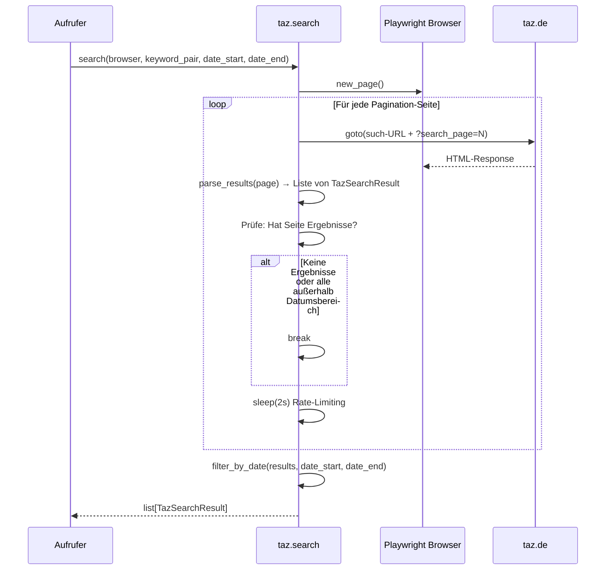

# Plan: AP2a — taz.de Suche

## Kontext

AP2a implementiert die automatische Suche auf taz.de für alle 17 Keyword-Paare. Die Suche nutzt Playwright (headless Chromium), durchläuft alle Pagination-Seiten und filtert Ergebnisse nach Datum. taz.de bietet keinen Datumsfilter in der URL — die Filterung geschieht im Code.

## Entscheidungen

- **Datenstruktur:** `TazSearchResult` dataclass mit `title`, `url`, `date` — lokal in `src/taz/`
- **Retry:** 3 Versuche mit konservativem exponentiellem Backoff (5s, 15s, 45s)
- **Rate-Limiting:** 2 Sekunden Pause zwischen Seitenaufrufen
- **Logging:** `logging`-Modul statt print() — gilt projektübergreifend
- **Rückgabe:** `list[TazSearchResult]`, bereits nach Datum gefiltert
- **Integration in main.py:** noch nicht — kommt in AP7

---

## Sequenzdiagramm



---

## Schritt 1: Datenstruktur definieren

**Datei:** `src/taz/models.py`

Die dataclass für Suchergebnisse. Wird von Search und später von Scraping (AP2b) verwendet.

```python
@dataclass
class TazSearchResult:
    title: str
    url: str
    date: date
```

---

## Schritt 2: Suchfunktion implementieren

**Datei:** `src/taz/search.py`

Kernmodul mit zwei öffentlichen Funktionen:

### `search(browser, keyword_pair, date_start, date_end) -> list[TazSearchResult]`

Hauptfunktion. Ablauf:
1. Suchbegriffe mit `+` verknüpfen, URL-encoden
2. Such-URL bauen: `https://taz.de/!s={encoded}/`
3. Erste Seite laden (kein `search_page`-Parameter)
4. Ergebnisse parsen via `_parse_results_page(page)`
5. Pagination: Solange Ergebnisse vorhanden, nächste Seite laden (`?search_page=0`, `1`, ...)
6. Rate-Limiting: 2s Pause zwischen Seitenaufrufen
7. Nach Datum filtern und zurückgeben

### `_parse_results_page(page) -> list[TazSearchResult]`

Interne Funktion. Extrahiert aus der aktuellen Seite:
- Alle `<a>`-Elemente mit Suchergebnis-Struktur (enthalten `<h3>` und `<p>`)
- Titel aus `<h3>`
- URL aus `href` (zu absoluter URL vervollständigen)
- Datum aus `<p>` (Format `DD.M.YYYY` parsen → `date`)

### Retry-Logik

Wrapper `_navigate_with_retry(page, url)`:
- 3 Versuche
- Backoff: 5s → 15s → 45s
- Fängt `TimeoutError` und `Error` von Playwright

### Pagination-Ende erkennen

- Wenn `_parse_results_page` eine leere Liste zurückgibt → keine weiteren Seiten
- Zusätzlich: Gesamtanzahl aus "Suchergebnis 1 bis 20 von N" parsen als Plausibilitätscheck

---

## Schritt 3: Tests schreiben

**Datei:** `tests/test_taz_search.py`

### Unit-Tests (mit HTML-Fixtures)

- `test_parse_results_page_extracts_title_url_date` — Fixture mit typischer Ergebnisseite
- `test_parse_results_page_empty` — Leere Ergebnisseite gibt `[]` zurück
- `test_parse_results_page_handles_umlauts` — Titel mit Umlauten korrekt extrahiert
- `test_date_filter` — Ergebnisse außerhalb des Datumsbereichs werden gefiltert
- `test_date_parsing` — verschiedene Datumsformate (1-stellig/2-stellig Tag/Monat)

### Fixtures

**Datei:** `tests/fixtures/taz_search_results.html` — HTML einer typischen taz.de-Suchergebnisseite
**Datei:** `tests/fixtures/taz_search_empty.html` — HTML einer leeren Suchergebnisseite

Die Fixtures werden mit dem Playwright-MCP erstellt: Echte taz.de-Seite laden, relevanten HTML-Ausschnitt speichern.

---

## Schritt 4: Modul exportieren

**Datei:** `src/taz/__init__.py`

```python
from .models import TazSearchResult
from .search import search
```

---

## Dateien-Übersicht

### Neue Dateien
| Datei | Beschreibung |
|-------|-------------|
| `src/taz/models.py` | `TazSearchResult` dataclass |
| `src/taz/search.py` | Suchfunktion mit Pagination, Parsing, Retry |
| `tests/test_taz_search.py` | Unit-Tests für Parsing und Datumsfilter |
| `tests/fixtures/taz_search_results.html` | HTML-Fixture: Suchergebnisseite |
| `tests/fixtures/taz_search_empty.html` | HTML-Fixture: leere Ergebnisseite |

### Geänderte Dateien
| Datei | Änderung |
|-------|----------|
| `src/taz/__init__.py` | Exports hinzufügen |
