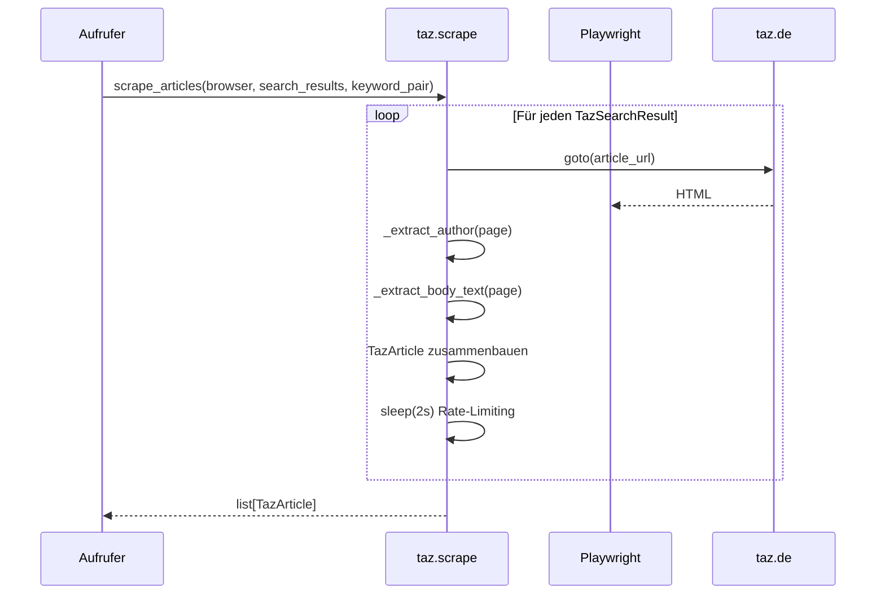

# Plan: AP2b — taz.de Artikeldetails

## Kontext

AP2b extrahiert für jeden in AP2a gefundenen Artikel den Autor und den Volltext von der taz.de-Detailseite. Da taz.de keine Paywall hat, ist der Volltext immer zugänglich. Die Ergebnisse werden in einer neuen `TazArticle`-Datenstruktur zusammengeführt, die alle Felder der finalen CSV enthält.

## Entscheidungen

- **Autor**: Aus `div.author-name-wrapper a` extrahieren. Bei Agenturmeldungen (dpa, ap) den Agentur-Prefix aus dem Bodytext als Autor verwenden, falls kein benannter Autor vorhanden. Alle verfügbaren Informationen mitnehmen.
- **Artikeltext**: Aus `p.bodytext.paragraph.typo-bodytext` innerhalb `<article>` extrahieren. Agentur-Prefixe (`dpa | `, `ap | `) bleiben im Text und zählen zum Character Count.
- **Character Count**: `len(text)` inklusive Leerzeichen und Zeilenumbrüche.
- **JSON-LD**: Nicht verwenden (Autor fehlt, Text abgeschnitten).
- **Datenstruktur**: Neue `TazArticle` dataclass, `TazSearchResult` bleibt unverändert.

---

## Sequenzdiagramm



---

## Schritt 1: Datenstruktur erweitern

**Datei:** `src/taz/models.py`

Neue dataclass `TazArticle` mit allen Feldern für die finale CSV:

```python
@dataclass
class TazArticle:
    date: date
    url: str
    title: str
    author: str          # Leer wenn kein Autor
    char_count: int
    search_terms: str    # Format: "Begriff1+Begriff2"
```

---

## Schritt 2: Scraping-Modul implementieren

**Datei:** `src/taz/scrape.py`

### `scrape_articles(browser, results, keyword_pair) -> list[TazArticle]`

Hauptfunktion. Für jeden `TazSearchResult`:
1. Artikelseite laden (mit Retry via `_navigate_with_retry` aus search.py)
2. Autor extrahieren via `_extract_author(page)`
3. Bodytext extrahieren via `_extract_body_text(page)`
4. `TazArticle` zusammenbauen
5. Bei Fehler: loggen und Artikel überspringen

### `_extract_author(page) -> str`

1. Suche `div.author-name-wrapper a` im Artikelheader (erste `div.author-container`)
2. Falls gefunden: Autorname aus dem Link-Text
3. Falls mehrere Autoren: kommagetrennt zusammenführen
4. Falls kein benannter Autor: Leerstring zurückgeben

### `_extract_body_text(page) -> str`

1. Alle `p.bodytext` innerhalb `article` selektieren
2. Text aller Absätze mit `\n` verbinden
3. Agentur-Prefix bleibt im Text

### Retry und Rate-Limiting

`_navigate_with_retry` aus `search.py` wiederverwenden (import). Rate-Limiting: 2s zwischen Artikelaufrufen.

---

## Schritt 3: Tests schreiben

**Datei:** `tests/test_taz_scrape.py`

Unit-Tests mit HTML-Fixtures:
- `test_extract_author_named` — Artikel mit benanntem Autor
- `test_extract_author_none` — Artikel ohne Autor (Agenturmeldung ohne Byline)
- `test_extract_author_multiple` — Mehrere Autoren
- `test_extract_body_text` — Artikeltext korrekt extrahiert
- `test_extract_body_text_with_agency_prefix` — Agentur-Prefix bleibt im Text
- `test_char_count` — Character Count stimmt
- `test_scrape_skips_failed_article` — Fehlerhafte Artikelseite wird übersprungen

### Fixtures

**Datei:** `tests/fixtures/taz_article.html` — Artikel mit benanntem Autor
**Datei:** `tests/fixtures/taz_article_agency.html` — Agenturmeldung

---

## Schritt 4: Smoke Test

Live-Test gegen taz.de mit 2–3 echten Artikel-URLs aus AP2a:
1. Temporäres Skript erstellt, nicht committet
2. Prüft: Wird der Autor korrekt extrahiert? Ist der Bodytext vollständig? Stimmt der Character Count?
3. Mindestens einen Artikel mit benanntem Autor und einen mit Agenturmeldung testen
4. Falls Selektoren nicht zur echten Seite passen: Parser und Fixtures korrigieren
5. Skript nach erfolgreicher Verifikation löschen

---

## Schritt 5: Module exportieren und main.py erweitern

**Datei:** `src/taz/__init__.py` — `TazArticle` und `scrape_articles` exportieren

**Datei:** `main.py` — Nach der Suche für jedes Keyword-Paar die Artikeldetails scrapen und anzeigen (Autor, Character Count).

---

## Dateien-Übersicht

### Neue Dateien
| Datei | Beschreibung |
|-------|-------------|
| `src/taz/scrape.py` | Artikeldetails extrahieren (Autor, Text, Character Count) |
| `tests/test_taz_scrape.py` | Unit-Tests für Scraping |
| `tests/fixtures/taz_article.html` | Fixture: Artikel mit benanntem Autor |
| `tests/fixtures/taz_article_agency.html` | Fixture: Agenturmeldung |

### Geänderte Dateien
| Datei | Änderung |
|-------|----------|
| `src/taz/models.py` | `TazArticle` dataclass hinzufügen |
| `src/taz/__init__.py` | Neue Exports |
| `main.py` | Artikeldetails scrapen und anzeigen |
